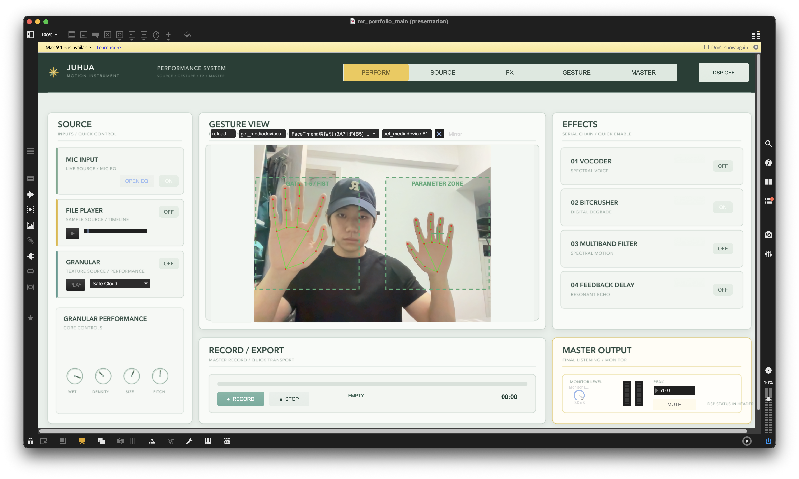
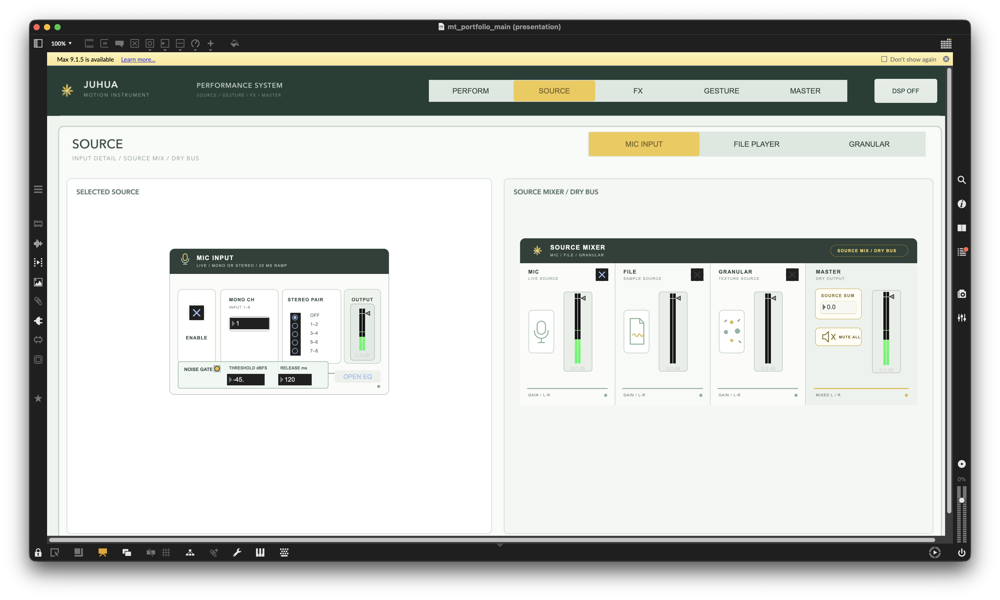
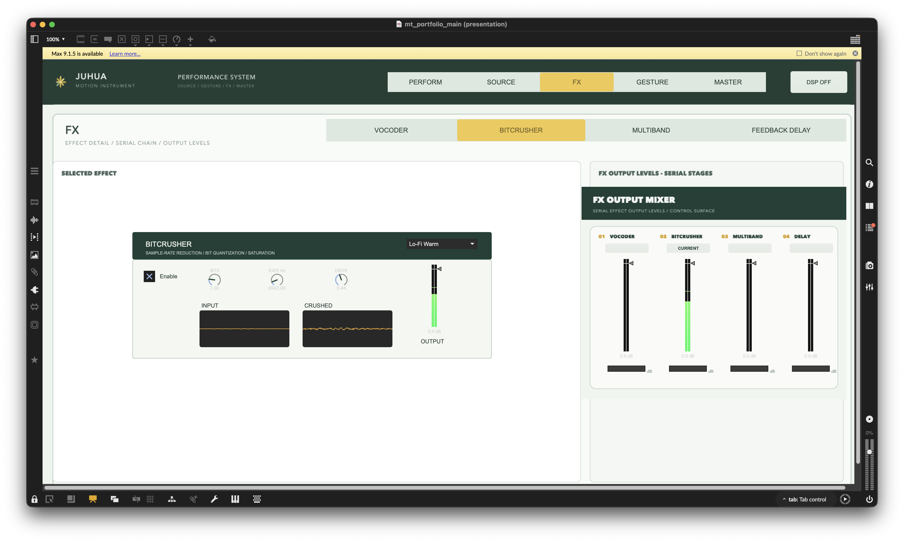
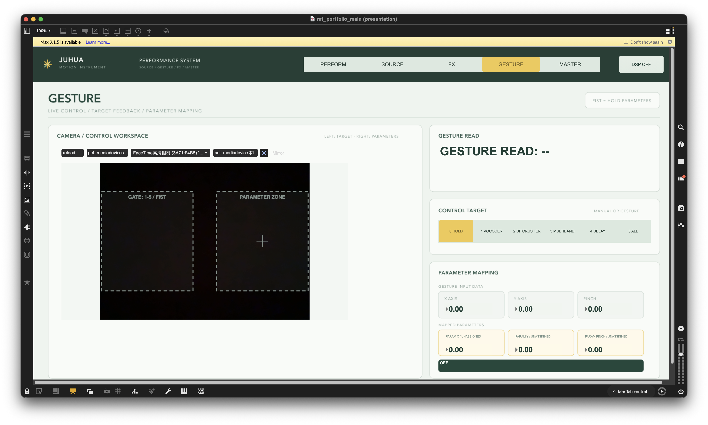
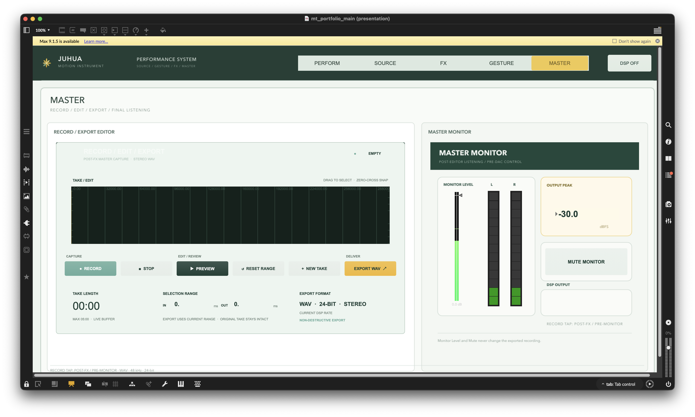

# MOTION INSTRUMENT

[English README](README.md) · [项目阐述（PDF）](docs/MOTION_INSTRUMENT_Project_Statement_Draft_ZH.pdf)

MOTION INSTRUMENT 是一个基于 Max/MSP 的实时演奏系统，通过摄像头识别手部动作并控制声音。项目将三类音源、固定串联效果链、空间角色手势控制，以及录音、简单编辑和导出整合在一套五页面界面中。



## 当前版本

本仓库包含可在 Max 9 中运行的完整作品集原型。它目前是 Max Project，尚未封装为 VST、Audio Unit、Max for Live Device 或独立应用。

### 音频系统

- 三类音源：带 EQ 的麦克风输入、文件播放器和 Granular 乐器
- Source Mixer：各音源独立启用、增益调节与电平反馈
- 固定串联效果链：**Vocoder → Bitcrusher → Multiband Filter → Feedback Delay**
- 每个串联阶段都具有独立输出增益和电平显示
- 最终效果链后的立体声录音、波形选区、试听与 24-bit WAV 导出
- 独立监听增益和静音；不会改变导出的录音文件

### 手势系统

- 通过 Max `jweb` 嵌入 MediaPipe 手部追踪
- 按手所在工作区分配角色，不依赖容易判断错误的 Left/Right 标签
- Target 工作区用数字手势 `1–5` 选择控制目标，握拳冻结参数更新
- Parameter 工作区将归一化 X、Y 和 Pinch 数据映射到当前效果器
- 基于时间戳的确认与平滑，减少摄像头帧率变化对响应速度的影响
- Gesture 页面直接显示识别数字、当前目标、原始输入值和映射后参数

| 目标 | X | Y | Pinch |
| --- | --- | --- | --- |
| 1 Vocoder | Brightness | Carrier Tone | Noise Mix |
| 2 Bitcrusher | Sample Rate | Bit Depth | Drive |
| 3 Multiband | Focus | Contrast | Spread |
| 4 Delay | Delay Time | Feedback | Stereo Offset |
| 5 All | 同时控制四个效果器 | 同时控制四个效果器 | 同时控制四个效果器 |

选择手势控制目标不会自动启用效果器；效果器的启用与旁通仍由演奏界面明确控制。

## 界面页面

| Source | FX |
| --- | --- |
|  |  |

| Gesture | Master |
| --- | --- |
|  |  |

五个页面各自承担不同任务：**Perform** 用于现场演奏，**Source** 用于音源编辑与混音，**FX** 用于效果器细调，**Gesture** 用于摄像头反馈和参数映射，**Master** 用于录音、导出与最终监听。

## 打开方式

1. 安装 Cycling '74 Max 9。
2. 克隆或下载完整仓库，并保持原有目录结构。
3. 打开 `geehon-motion-system.maxproj`。
4. 从 Max Project 窗口打开 `mt_portfolio_main.maxpat`。
5. macOS 请求摄像头权限时选择允许，再在 Gesture 页面选择摄像头。
6. 打开 DSP，启用至少一个音源并提高 Source Mixer 电平，再按需要启用效果器。

当前手势模块在运行时从网络加载 MediaPipe 库和模型资源。首次连接新的声卡或扬声器时，请先降低监听音量。

## 仓库结构

```text
geehon-motion-system.maxproj   Max Project 正式入口
patchers/mt_portfolio_main.maxpat
patchers/inputs/               Mic、File、Granular 音源
patchers/effects/              四个串联效果器
patchers/mixers/               Source、FX Output 和监听控制
patchers/control/              手势追踪与控制路由
patchers/dsp/                  Granular 与 Vocoder DSP 抽象
web/hand-landmarker/           jweb 桥接与 MediaPipe 集成
javascript/                    手势映射和界面控制逻辑
assets/ui/                     界面资源
tests/                         静态结构与逻辑检查
docs/                          项目阐述与技术说明
archive/                       研究原型和已停用模块
```

## 检查与文档

运行完整静态检查：

```bash
node tests/test_maxpat_integrity.js
```

静态检查用于验证 Patch 结构和路由；声音、摄像头、延迟与录音行为仍需在目标电脑的 Max 中人工测试。

- [中文项目阐述（PDF）](docs/MOTION_INSTRUMENT_Project_Statement_Draft_ZH.pdf)
- [英文项目阐述（PDF）](docs/MOTION_INSTRUMENT_Project_Statement_Draft_EN.pdf)
- [系统架构](docs/architecture.md)
- [依赖与来源](docs/dependencies.md)

## 依赖与来源

音频系统主要使用 Max/MSP 原生对象。手部追踪改编自 [lysdexic-audio/jweb-hands-landmarker](https://github.com/lysdexic-audio/jweb-hands-landmarker)，原项目说明与 GPL-3.0 许可证保留在 `web/hand-landmarker/`。详细信息见 [docs/dependencies.md](docs/dependencies.md)。
